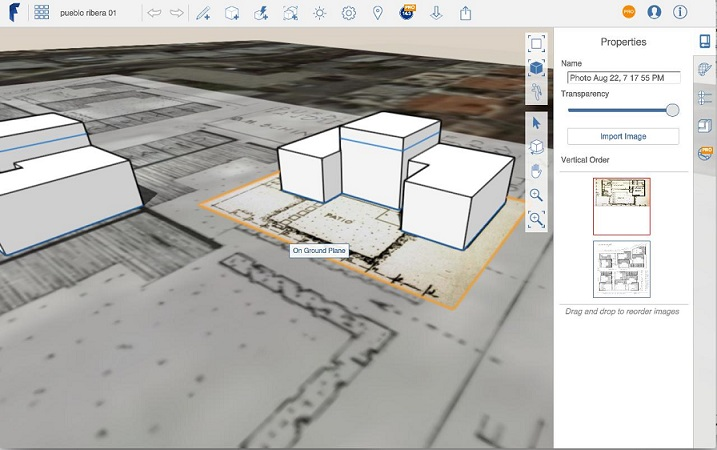

# イメージを設計に追加する

---

地面オーバーレイやその他のイメージを適用することにより、設計を見やすくして現実感を加えます。

イメージ ファイルはさまざまな用途に使用できます。たとえば、地面オーバーレイを使用すると、スケッチへのデータの追加やトレースを行うことができます。イメージを地面オーバーレイとして読み込んだ後は、画面の右側にあるパレットを使用して、イメージのプロパティを修正できます。パレットではイメージの名前と透過度を編集できます。また、[縦方向に表示]ツールを使用すると、取り込んだ衛星画像を含め、すべての地面オーバーレイを管理できます。

* 

[縦方向に表示]では、必要に応じてオーバーレイを積み重ねることができます。

#### このセクションの内容

* [地面オーバーレイ イメージを読み込み、修正する](../Import and Modify Ground Overlay Images.md)

設計キャンバスのイメージを取得し、必要に応じて変更します。

