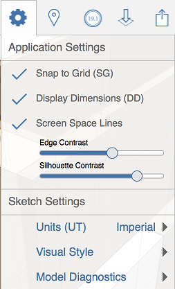

# アプリケーションとスケッチの設定

---

アプリケーション全体の設定やスケッチ固有の設定を修正し、アプリケーションと各スケッチの表示および動作方法を変更します。

* アプリケーション全体の設定を修正し、FormIt 360 アプリケーション全体の表示および動作方法を変更します。
* スケッチ固有の設定を修正し、現在開いているスケッチの表示および動作方法を変更します。

* 

#### このセクションの内容

* [スケッチ設定 ](../Sketch Settings.md)

スケッチ固有の設定を修正し、現在のスケッチの表示および動作方法を変更します。

* [アプリケーション設定](../Application Settings.md)

アプリケーション全体の設定を修正し、FormIt 360 アプリケーション全体の表示および動作方法を変更します。

