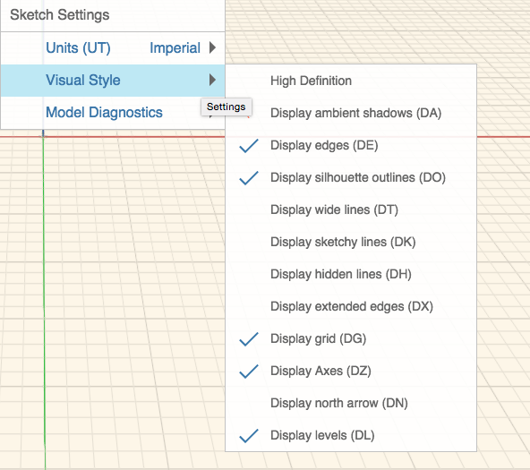

# スケッチの設定

---

スケッチ固有の設定を修正し、現在のスケッチの表示および動作方法を変更します。

### スケッチの設定

| | |
| ---- | ---- |
||*単位*: インチ/フィート単位またはメートル単位に変更します。*表示スタイル* * *高解像度*: グラフィックスの表示を高ピクセル解像度表示で向上します。 この設定によりパフォーマンスが低下する場合があります。* *アンビエント シャドウを表示*: モデルに柔らかい影を追加するにはこの機能に切り替えます。* *エッジを表示*: モデルのエッジをオフにするにはこの機能を切り替えます。 このオプションはアンビエント シャドウを表示する場合に適しています。* *シルエットのアウトラインを表示*: わずかに太い線をシルエット エッジの周囲に描画することによりフォームを強調します。* *太線を表示*: 最も太い線を表示します。* *手書き風の線を表示*: 手書きでスケッチされたような線の表示/非表示を切り替えて、スケッチの外観を変更します。* *隠線を表示*: 通常は他の面に隠れて非表示になる線を薄く表示します。* *延長されたエッジを表示*: 線が交差する部分の短い延長線を表示します。* *グリッドを表示*: グリッドの表示/非表示を切り替えます。* *軸を表示: *座標系の軸の表示/非表示を切り替えます。* *北向き矢印を表示: *北向き矢印の表示/非表示を切り替えます。* *レベルを表示*: レベルの表示/非表示を切り替えます。|
||*モデル診断** *背面を表示: *外側に向いている異常な面を紫色で表示します* *密閉性に関する問題を表示*: オブジェクトに関連付けられていない面の穴や線分/エッジを紫色で表示します|

