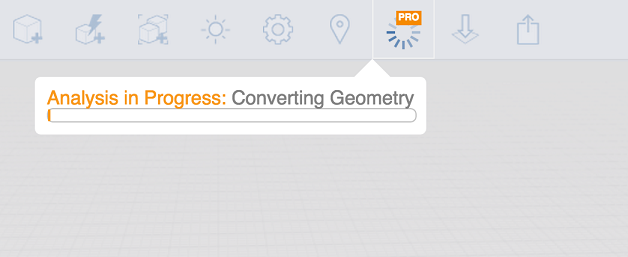
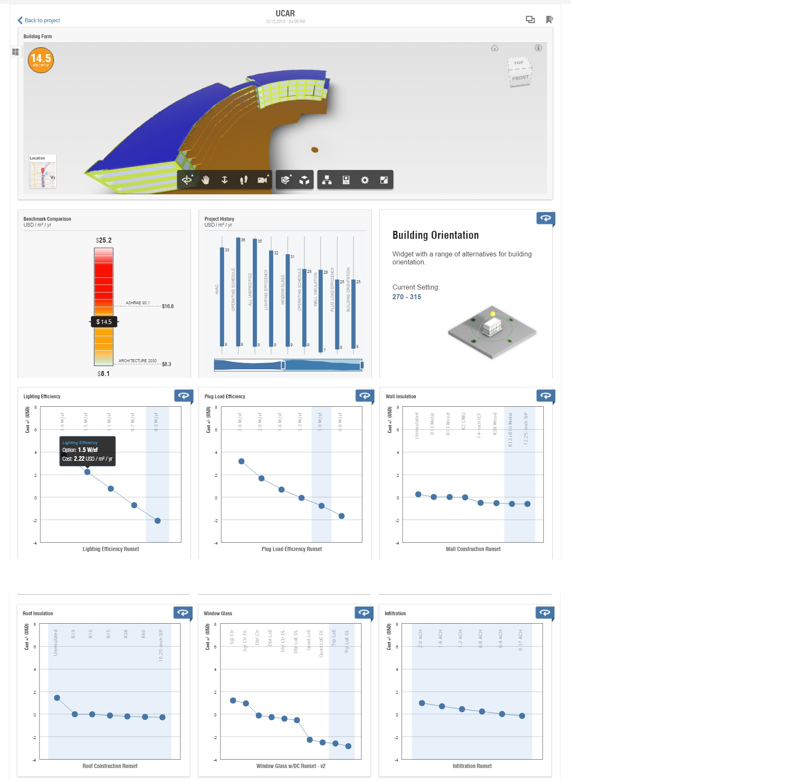

# 建物全体のエネルギー解析

---

壁の断熱、HVAC 効率など、建物パフォーマンスに影響を及ぼす要素を評価します。

Autodesk Formit 360 Pro のみ

FormIt 360 Pro のエネルギー解析機能を使用すると、多くの要因に基づいて設計のパフォーマンスがどのように変化するかを明確に把握できます。この機能を使用するには、まず、[プロジェクトの位置](../../Location/README.md)を設定し、少なくとも 1 つのソリッド オブジェクトに[レベル](../../Levels and Space Usage/README.md)を適用する必要があります。 [エネルギー解析]ボタンをクリックして、解析プロセスを開始します。

モデルは変換されると Green Building Studio に送信されて解析されます。結果が出ると電子メールを受け取ります。[結果を表示]をクリックして[エネルギー解析]ダッシュボードを開きます。

[エネルギー解析]ダッシュボードには現在、エネルギー モデルの 3D ビュー、これまでに実行された解析の履歴、エネルギー コスト範囲(ECR)が表示されます。ECR には建物全体のエネルギー コストの平均値、最小値、最大値が表示されます。これらの値は、一般的な設計や運用要素を幅広く適用し、まとめてシミュレーションすることにより算出されます。ECR にはプロジェクト向けに [Architecture 2030](http://architecture2030.org/2030_challenge/the_2030_challenge) ベンチマークも表示されます。 この一般的なベンチマークとプロジェクトを比較することにより、プロジェクトのパフォーマンスを相対的に確認できます。Architecture 2030 ベンチマークは、大規模な調査に基づいて特定された過去の実際の建物エネルギー使用の割合(現在は 60%)に応じて算出されます。ECR には個々の要因に基づいて値が表示されます。各要因は、建物エネルギーの使用に影響を与える建物フィーチャのさまざまな側面に関係しています。

要因ウィジェットを開くと、要因を変化させて、それがエネルギー コストの平均値にどのように影響するかを確認することができます。

