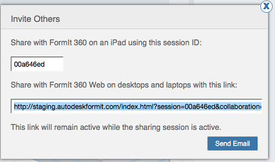

# 他のユーザをセッションに招待する

---

コラボレーション チームを作成します。

## 他のユーザをセッションに招待する

* ツールバーの[コラボレーション]ドロップダウン メニューで、[ユーザを招待]をクリックします。

ダイアログが表示され、iOS ユーザとの共有に使用するセッション ID と、Web ユーザとの共有に使用する URL が示されます。これらの情報はコピーして共有することも、[電子メールで送信]ボタンをクリックして送信することもできます。電子メールが自動的に生成され、共有メンバーに送信することができます。iOS または Web デバイスからセッションに参加する方法の詳細については、「[セッションに参加する](../Joining a Session.md)」を参照してください。 デスクトップ Web クライアントを使用している場合は、電子メールに記載されている URL をクリックし、招待されたセッションに参加してください。

