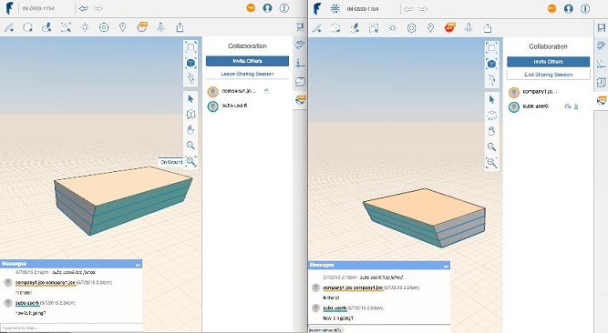

# コラボレーション

---

同じスケッチで他のユーザと同時に作業したり、作業内容を後で共有します。注

コラボレーション機能を使用する前に、FormIt 360 Pro を有効にする必要があります。[コラボレーション]アイコンをクリックすると、FormIt 360 Pro 用の [http://360.autodesk.com](http://360.autodesk.com) アカウントを使用してログインするように促すメッセージが表示されます。

* コラボレーション セッションを開始すると、設計内容や編集内容を他のユーザが表示できるようになります。

共有セッションを通じた同時コラボレーションに加えて、他のさまざまな方法で作成した作業内容を共有できます。設計イメージを電子メールで送信したり、スケッチを書き出すことにより、作業内容を他のプログラムで使用できるようになるため、他のユーザがレビューしやすくなります。

* 共有オプションはアクション ツールバーの左上隅にある[ファイル]アイコンをクリックしてアクセスできます。作業内容は、Autodesk 360 ドライブまたはローカル ドライブに書き出して共有できます。「[ファイルとイメージを書き出す](../../Manage Your Data/Export Files and Images.md)」を参照してください。

#### 参照

* [ファイルとイメージを書き出す](../../Manage Your Data/Export Files and Images.md)
* [ 作業内容を保存する](../../Manage Your Data/Saving Your Work.md)

#### このセクションの内容

* [コラボレーション セッションを開始および停止する](../Start and Stop Collaborative Sessions.md)

同じ設計プロジェクトで作業できるように、他のユーザを招待します。

* [セッションに参加する](../Joining a Session.md)

コラボレーションに参加します。

* [他のユーザをセッションに招待する ](../Inviting Others to a Session.md)

コラボレーション チームを作成します。

* [セッション カメラをフォローする](../Following a Session Camera.md)

別の共有メンバーの視点から作業内容を確認します。

* [共有メンバーとチャットする ](../Chat with Collaborators.md)

設計時にメンバーと会話します。

