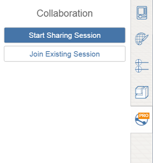

# コラボレーション セッションを開始および停止する

---

同じ設計プロジェクトで作業できるように、他のユーザを招待します。

他のユーザと作業内容を共有できます。

## 共有セッションを開始する

* ツールバーの右端にある[共有]アイコンをクリックします。まだログインしていない場合は、[Autodesk 360](https://360.autodesk.com) アカウントにサインインするように求められます。 次に、[共有セッションを開始]オプションをクリックします。

他のユーザを招待するためのダイアログが表示されます。セッションが正常に開始されると、[コラボレーション]タブに、Autodesk 360 のアバターがアイコンとして表示されます。

## セッションを終了する

* [コラボレーション]ドロップダウン メニューで[共有セッションを終了]を選択します。

ゲストは共有セッションを終了できません。

