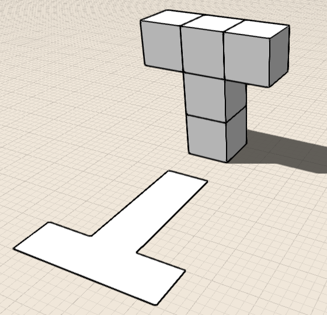
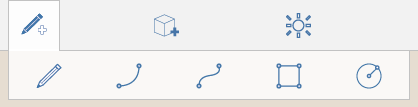
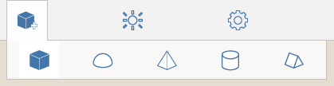

# 設計を作成する

---

グリッドのバックグラウンド、衛星画像、またはオーバーレイにジオメトリ形状をスケッチまたは配置します。

* 2D および 3D ジオメトリ作成ツールを使用して、コンセプト モデルを作成します。最初に 2D 形状をスケッチするか、3D プリミティブを配置します。次に、面をプッシュまたはプルしたり、さまざまな変換ツールやブール演算を使用して設計を修正します。

ジオメトリを作成する方法には、形状をスケッチする方法とプリミティブを配置する方法の 2 通りがあります。ジオメトリは、読み込むこともできます。

スケッチに使用できるツールには線分、円弧、スプライン、長方形、円の 5 種類があります。

#### 形状をスケッチする

* 作成ツールはアクション バーにあります。[スケッチ]ツール セットでツールをクリックし、形状を作成します。次に、ビュー内をクリックして形状を定義します。

配置できる 3D プリミティブには立方体、ドーム、円柱、プリズム、角錐の 5 種類があります。

#### プリミティブを配置する

* プリミティブを配置するには、[ジオメトリ作成]ツールバーのツールをクリックします。次に、キャンバス内をクリックしてジオメトリを配置します。

形状をスケッチするか、プリミティブを配置した後、より複雑な設計を作成するには、いくつかのコンテキスト ツールを使用してジオメトリを修正します。選択、削除、移動、スケール、回転、押し出し、面の切り取り、面のオフセット、傾斜、コピー/貼り付け、配列、かぶり、スイープ、ロフト、ブール論理和、ブール論理差などの操作を行います。これらの操作の詳細については、次のリストのトピックを参照してください。

#### 参照

* [修正: 削除、編集、移動する ](../../Modify Designs/Modify Delete, Edit, Move.md)
* [修正: 面を押し出す、切り取る、オフセットする](../../Modify Designs/Modify Extrude, Cut-Offset Faces.md)
* [修正: エッジ/面を選択する](../../Modify Designs/Modify Select Edge-Face or Object.md)
* [修正: 拡大/縮小および回転する ](../../Modify Designs/Modify Scale and Rotate.md)
* [修正: 傾斜を適用、配列化、コピー、貼り付け ](../../Modify Designs/Modify Tilt, Array, Copy-Paste.md)
* [修正: ブール演算](../../Modify Designs/Modify Boolean Operations.md)
* [修正: かぶり/スイープ/ロフト ](../../Modify Designs/Modify Cover, Sweep, Loft.md)

#### このセクションの内容

* [3D モデルとイメージを読み込む ](../Import 3D Models and Images.md)

さまざまな目的に応じてオーバーレイやイメージを設計に追加します。

* [形状をスケッチする](../Sketching Shapes.md)

線分、円弧、スプライン、長方形、円を使用して、建物設計に組み入れる形状を作成します。

* [プリミティブを配置する](../Place Primitives.md)

事前設定済みの形状を設計建物ブロックとして使用します。

