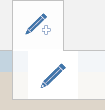
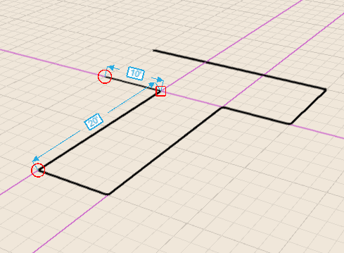
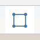
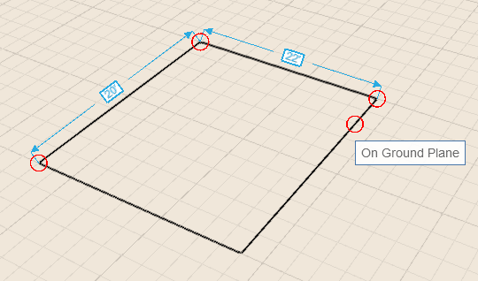

# 形状をスケッチする

---

線分、円弧、スプライン、長方形、円を使用して、建物設計に組み入れる形状を作成します。

描画ツールを選択した後、キャンバス上の任意の場所にカーソルを合わせると、スナップと推定配置点が表示されるため、それらを基準に最初の点を配置できます。

## 線分を使用する

1. 作図領域内をマウスで 1 回クリックし、線分の最初の端点を配置します。
2. カーソルを合わせてスナップ/推定点を表示してクリックし、線分の 2 番目の端点を配置します。
3. 次の線分セグメントを描画するには、クリックして別の端点を作成する必要があります。

軸上で線分を描画しているときに[Shift]キーを押すと、その軸上の線分がロックされるため、軸から移動して線分を延長できます。注: [長さを設定]ダイアログを開いて長さの値を入力するには、[Tab]キーを使用してください。[グリッドにスナップ]がオフになっている場合、[長さを設定]ボックスには整数値のみが表示されます。[グリッドにスナップ]がオンになっている場合、数値はフィート単位またはメートル単位の分数値で表示されます。

## 円弧を使用する

1. 円弧の最初の端点を配置する準備ができたら、マウスをクリックします。
2. 上記と同じ手順に従い、カーソルを合わせてスナップ/推定点を表示してクリックし、円弧の 2 番目の端点を配置します。
3. 円弧を終了するには、もう一度クリックして円弧の角度を設定します。 
## スプラインを使用する

1. スプラインの最初の端点を配置する準備ができたら、マウスをクリックします。
2. 上記と同じ手順に従い、カーソルを合わせてスナップ/推定点を表示してクリックし、スプラインの 2 番目の点を描画します。注: スプライン曲線は自動的に表示されます。
3. スプラインの元の端点をクリックし、スケッチのループを閉じて、平面を作成します。
## 長方形を使用する

1. 長方形の最初のコーナーを配置する準備ができたら、マウスをクリックします。
2. 上記と同じ手順に従い、カーソルを合わせてスナップ/推定点を表示してクリックし、長方形の 2 番目のコーナーを配置します。
3. 最後に、上記と同じ手順に従い、長方形の 3 番目のコーナーを配置します。
## 円を使用する

1. 円の中心点を配置する準備ができたら、マウスをクリックします。
2. 上記と同じ手順に従い、カーソルを合わせてスナップ/推定点を表示してクリックし、円の半径を設定します。

