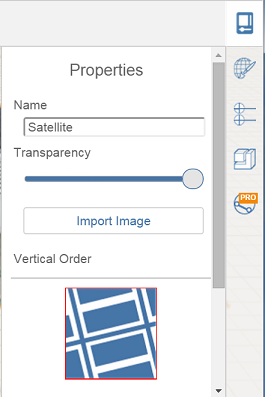

# 衛星画像を編集、再ロード、または削除する

---

位置のイメージを変更します。

## 衛星画像を使用して作業する

1. 衛星画像を削除または編集するには:
2. イメージをダブルクリックして選択し、[削除]をクリックします。または、
3. コンテキスト メニューを使用します。衛星画像をダブルクリックして選択し、画像を右クリックしてコンテキスト メニューを表示します。次に、[削除]アイコンを選択します。
#### 衛星画像を編集するには:

1. 他のイメージと同様、衛星画像の名前、透過度、縦方向を編集できます。

#### 衛星画像を再ロードするには:

1. 衛星画像を読み込む手順を繰り返します。

