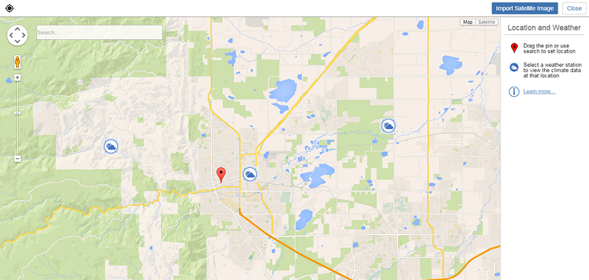

# 衛星画像を読み込む

---

詳細を追加して設計に現実感を加えます。

衛星画像や気象ステーションのデータは設計に重要な情報を追加します。

#### 衛星画像を読み込む

1. アクション バーの[位置]アイコンをクリックします。
2. 特定の位置を検索するか、マップ ビューで画面移動およびズームして位置を設定します。
3. 位置が見つかったらクリックし、赤いピンを配置します。
4. [衛星画像を読み込む]をクリックし、航空写真をスケッチに追加します。
5. 表示されるダイアログを使用して衛星画像をトリムし、スケッチに関連するコンテキストを表示します。
6. 次のうちのいずれかを実行します。

* [完了]をクリックします。

この操作により、作図領域に戻って衛星画像を読み込まずにプロジェクトの位置が設定されます。衛星画像の読み込みは後からいつでも[位置]画面に戻って実行できます。

* [読み込みを終了]をクリックして位置を設定し、その位置の衛星画像を作図領域に追加します。

1. 付近のいずれかの気象ステーションをクリックし、地域の気象データの履歴を確認します。
2. 右上隅にある[X]をクリックして、表示されている気象ステーションを閉じます。

