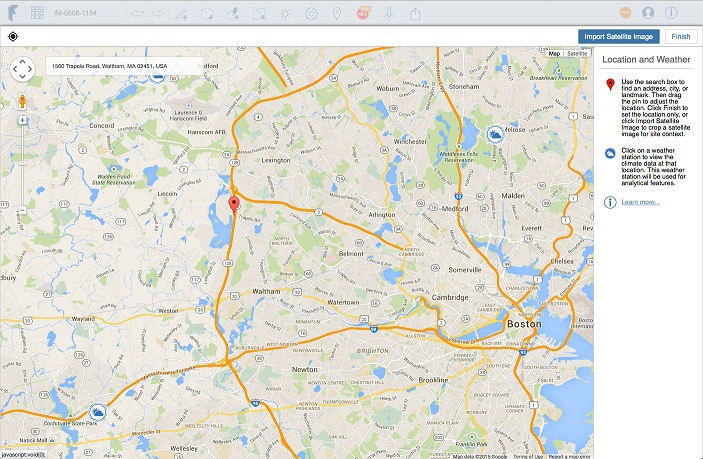

# 位置

---

地理的位置を設定し、建物パフォーマンスと気象データを設計に利用します。

設計の機能を最大化するには、位置機能を使用してスケッチの地理的位置を設定する必要があります。設計中に建物パフォーマンス データを使用する場合、位置を設定することは重要です。詳細については、「[建物パフォーマンス](../../Building Performance/README.md)」を参照してください。

* OBJ、STL、AXM 形式を使用し、ローカル ファイル システムからコンテキスト ジオメトリを[読み込む](../../Creating Designs/Import 3D Models and Images.md)ことができます。

#### このセクションの内容

* [位置を設定する](../Set a Location.md)

スケッチの地理的位置を確定します。

* [衛星画像を読み込む](../Import a Satellite Image.md)

詳細を追加して設計に現実感を加えます。

* [衛星画像を編集、再ロード、または削除する](../Edit, Reload, or Remove a Satellite Image.md)

位置のイメージを変更します。

