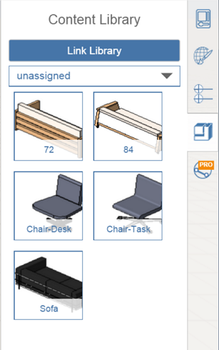

# コンテンツ ライブラリにリンクする

---

以前に保存したプロジェクトおよび外構ファイルにアクセスします。

1. キャンバスの右側にある[プロパティ]パネルで、[コンテンツ ライブラリ]アイコンをクリックします。

2. [ライブラリにリンク]ボタンをクリックします。
3. ライブラリの場所(ローカル ドライブまたは A360 ドライブ)を選択します。

4. ファイル ナビゲーション ダイアログで、最上位レベルのコンテンツ ライブラリ フォルダを参照します。
5. コンテンツ ファイルを選択します。

