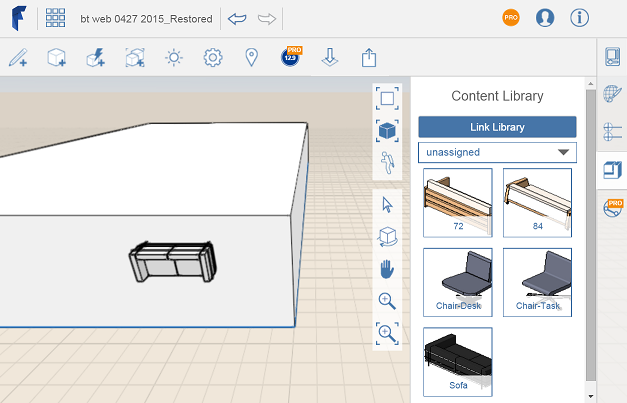

# コンテンツを配置する

---

設計でコンテンツ ライブラリ ファイルのデータを使用します。

注: ライブラリにローカルでリンクした後、新しい FormIt 360 Web セッションを開始する場合は、コンテンツ ライブラリのリンクを設定し直す必要があります。

1. サムネイル イメージにマウスを合わせます。
2. コンテンツをキャンバスにドラッグ アンド ドロップします。または、サムネイルをクリックしてマウスをキャンバスに移動し、再度クリックして配置します。

