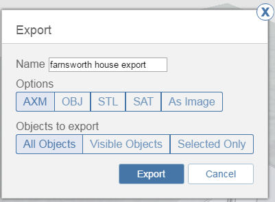

# ファイルとイメージを書き出す

---

ファイルを A360 ドライブまたはローカル ストレージに保存します。

1. [書き出し]アイコンをクリックし、[書き出し]メニューを開きます。

2. 書き出し形式を選択し、A360 またはローカルに保存します。

* [AXM]を選択すると、FormIt 360 ファイル形式で保存します
* [OBJ]形式を選択すると、マテリアル定義とメッシュ データを保存します。これは 3DS Max や、OBJ をサポートするその他のシステムで開く場合に便利です
* [STL]は標準の 3D メッシュ交換形式です。3D プリンタ ワークフローに適しています
* [SAT]は標準の 3D ソリッド交換形式です
* [イメージとして]を選択すると、現在のビューをユーザ インタフェース コンポーネントなしで PNG として保存します

3. すべてのオブジェクトを書き出すか、表示されているオブジェクトを書き出すか、現在選択しているオブジェクトのみを書き出すかを選択します

