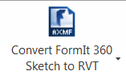
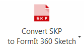

# FormIt 360 Converter

---

他のアプリケーションのファイルを変換して FormIt 360 内で使用します。

FormIt 360 Converter は Revit のアドインです。SketchUp、Revit など、他のアプリケーションのファイルを変換して FormIt 360 内で使用できるようにします。これは [FormIt 360 Web サイト](http://formit360.autodesk.com/blog/formit-converter/)から直接ダウンロードできます。

## RFA ファイルを FormIt 360 ファイルに変換する 

1. リボン メニューから[RFA を FormIt 360 コンテンツに変換]を選択します。
2. FormIt 360 コンテンツに変換する RFA ファイルが含まれているローカル フォルダを参照します。
3. 変換した FormIt 360 コンテンツを配置するローカル フォルダを参照します。
4. 必要に応じて、[A360 ドライブ コンテンツ フォルダにアップロード]をオンにします。
5. [OK]をクリックすると、Revit ですべての RFA が FormIt 360 コンテンツ(.AXM ファイル)に変換されます。サポートされるカテゴリは収納設備、点景、家具、家具システム、一般モデル、駐車場、外構、特殊部品、マスです。他のカテゴリはすべて無視されます。

ファイルを A360 ドライブにアップロードする場合は、Autodesk 360 へのログインを促すメッセージが表示されます(Revit にまだログインしていない場合)。AXM ファイルは A360 ドライブの /FormIt/Content フォルダに配置されます。FormIt 360 内でこのコンテンツを使用する方法の詳細については、「[コンテンツ ライブラリ](../Content Libraries/README.md)」を参照してください。

## FormIt 360 スケッチ(AXM)ファイルを Revit プロジェクトに変換する 

1. FormIt 360 スケッチ(.axm ファイル)を A360 ドライブからダウンロードします。
2. Revit 2015 を起動して、新しいプロジェクトを開始します。
3. [アドイン]から[FormIt 360 スケッチを RVT に変換]を選択し、前の手順でダウンロードした .axm ファイルを参照します。
4. このアドインによって FormIt 360 ファイル内のジオメトリが変換され、現在開いている RVT ファイルに配置されます。
1. スケッチされて押し出されたオブジェクトはマス ファミリになります。
2. グループ化されたオブジェクトはコピーされ、同じマス ファミリのインスタンスとして配置されます。
3. FormIt 360 内で特定のカテゴリが割り当てられたグループは同じカテゴリのファミリとして配置されます。これらのファミリは手動で同じカテゴリの他の Revit ファミリで置き換えることができます。
4. このアドインによって変換されたコンテンツは同じカテゴリのファミリとして配置されます。これらのファミリは[再ロード]機能を使用して、適切な RFA ファイルで置き換えることができます(次を参照)。

## SketchUp (SKP)ファイルを FormIt 360 スケッチ ファイルに変換する 

1. リボン メニューから[SKP を FormIt 360 コンテンツに変換]を選択します。
2. FormIt 360 コンテンツに変換する SKP ファイルが含まれているローカル フォルダを参照します。
3. 変換した FormIt 360 コンテンツを配置するローカル フォルダを参照します。
4. 必要に応じて、[A360 ドライブ コンテンツ フォルダにアップロード]をオンにします。
5. [OK]をクリックすると、Revit ですべての SKP が FormIt 360 コンテンツ(.AXM ファイル)に変換されます。

ファイルを A360 ドライブにアップロードする場合は、Autodesk 360 へのログインを促すメッセージが表示されます(Revit にまだログインしていない場合)。AXM ファイルは A360 ドライブの /FormIt/Content フォルダに配置されます。FormIt 360 内でこのコンテンツを使用する方法の詳細については、「[コンテンツ ライブラリ](../Content Libraries/README.md)」を参照してください。

## FormIt 360 コンテンツを Revit ファミリで置き換える 

1. 上記の手順に従って FormIt 360 スケッチを RVT ファイルに変換します。
2. [アドイン]から[ファミリを再ロード]を選択します。
3. 変換した FormIt 360 コンテンツに対応する RFA ファイルが含まれているローカル フォルダを参照します。
4. このアドインにより、すべてのファミリが、選択されたフォルダ内で見つかった適切なファミリで置き換えられます。

