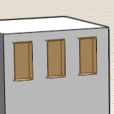

# スマート選択について

---

[Tab]キーを使用すると、類似オブジェクトを簡単に選択できます。

[Tab]キーを使用して、ジオメトリの配置と修正をすばやく行いましょう。

* 同じサイズの面の選択: 面にカーソルを合わせて[Tab]キーを押すと、ソリッド上でサイズが同じであるすべての面がハイライトされます。シングル クリックですべての面が選択されます。

* 面集団の選択: 面集団のいずれかの面にカーソルを合わせて[Tab]キーを 2 回押すと、集団に含まれているすべての面がハイライトされます。シングル クリックで面集団全体が選択されます。

* 同じサイズの面集団の選択: 面集団のいずれかの面にカーソルを合わせて[Tab]キーを 3 回押すと、ソリッド上でサイズが同じであるすべての面集団がハイライトされます。シングル クリックですべての面集団が選択されます。

* 深度選択: グループ インスタンスの一番上にある面にカーソルを合わせて[Spacebar]を押し、選択オプションを切り替え、同じ平面上にあるいずれかの面をクリックして選択します。

