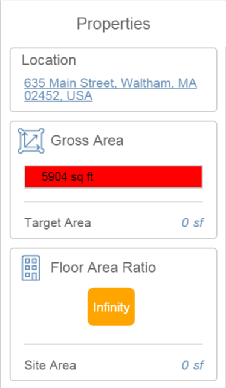

# オブジェクトのプロパティを調べる

---

建物オブジェクトの名前、体積、面積、レベル値を表示または変更します。

## プロパティを修正してスペースの更新を有効にする

1. スケッチ内の個々のオブジェクトのプロパティを編集するには、オブジェクト全体をダブル タップして選択し、右側にあるパレットを開いて[プロパティ]タブに移動します。
2. オブジェクトの名前の編集、体積と面積の確認、[レベル別の領域]の切り替えと確認、レベル値の追加や編集を行います。
3. スケッチ全体の[総面積]と[床面積率]を自動的に更新するには、オブジェクトごとに[レベル別の領域を適用]をオンに切り替えます。

