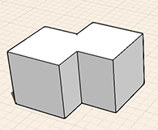

# 修正: ブール演算

---

結合(論理和演算)および切り取り(論理差演算)を使用して、オブジェクトを変更することができます。

1. 結合(論理和): 論理和演算を実行するには、演算対象のすべてのオブジェクトを選択します。 次に、コンテキスト メニューで論理和ツールを選択します。ジオメトリの交差部分と重複部分が、1 つのオブジェクトとして結合されます。
2. 切り取り(論理差): 既存のジオメトリの体積を減らすには、元のオブジェクトを選択し、
3. そのオブジェクトから切り取るオブジェクトを選択します。
4. 次に、コンテキスト メニューで論理差ツールを選択します。

交差している部分の体積が、元のオブジェクトから減算されます。

