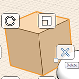
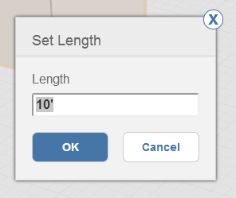

# 修正: 削除、編集、移動する

---

オブジェクトの削除、オブジェクトの場所の移動、オブジェクトのプロパティの編集を行います。

1.  ジオメトリを削除するには、最初に、削除するジオメトリを選択します。 次に、右クリックしてコンテキスト メニューを表示し、削除アイコンをクリックします。または、キーボードの[Delete]キーを押してもかまいません。
2. [移動]ツール、[配列]ツール、[面をプッシュ/プル]ツール、[オフセット]ツールなどの編集ツールを使用する場合、青い寸法ボックスが表示されます。 操作が完了したらこの寸法ボックスをクリックし、特定の値を入力します。[Tab]キーを押すと、[寸法値を入力]ダイアログが表示されます。このボックスで値を入力することもできます。
3.  エッジ、面、またはオブジェクトを移動するには、最初にそのいずれかを選択します。これにより、自動的に移動ツールが起動します。 マウスを操作してスナップと推定配置点を表示し、移動操作の開始位置を指定してクリックします。これにより、移動操作が開始されます。次に、オブジェクトの移動先となる位置にマウスを置き、スナップと推定配置点を表示します。もう一度クリックすると、オブジェクトが配置されます。

