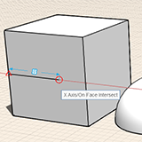

# 修正: 面を押し出す、切り取る、オフセットする

---

面のプッシュとプル、既存の形状に対する新しい形状のインプリント、既存のエッジから新しいエッジへのオフセットの作成について説明します。

1.  面のプッシュやプルを行うには、対象となる面をシングルクリックで選択し、もう一度クリックしてドラッグします。 面は前後に移動します。移動先のモデル要素にマウスカーソルを置いて、スナップと推定配置点を表示します。もう一度クリックすると、面の移動が完了します。元のエッジを保持するには、[Ctrl]キーを押したままにします。
2.  形状をインプリントするには、3D スケッチ ツールを使用して、直線、円弧、スプライン、長方形、または円を既存の面上に描画します。 この操作により、元の面からは独立してプッシュやプルを行うことができる新しい面が作成されます。
3.  面をオフセットするには、対象となる面を選択し、コンテキスト メニューでオフセット ツールをクリックします。 次に、面にマウスカーソルを置き、元のエッジからオフセットする一連のエッジを作成します。

