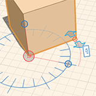

# 修正: 拡大/縮小および回転する

---

オブジェクトのサイズと向きを調整します。

1. エッジ、面、オブジェクトを拡大/縮小するには、最初にこれらのいずれかを選択して右クリックし、コンテキスト メニューを開いてスケール アイコンを選択します。 マウスのスクロール ホイールを使用して、ジオメトリの拡大と縮小を行います。
2. エッジ、面、オブジェクトを回転するには、要素を選択して右クリックし、コンテキスト メニューから回転ツールにアクセスします。 マウスを操作して分度器グラフィックを表示し、クリック操作で平面図を回転用に設定します。回転の始点を指定するには、青いグリップを使用します。必要に応じて、軸をリセットすることができます。矢印または編集可能な寸法ボックスを使用して、回転角度を設定します。要素を選択した後で[Q]キーを押しても、回転ツールにアクセスすることができます。

