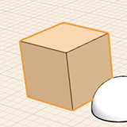

# 修正: エッジ、面、またはオブジェクトを選択する

---

オブジェクトやサーフェスを修正するには、最初にそのオブジェクトやサーフェスを選択する必要があります。

1. 面、エッジ、または頂点を選択するには、対象の面、エッジ、または頂点にマウス カーソルを置いてシングルクリックします。
2. オブジェクト全体を選択するには、対象のオブジェクトをダブルクリックします。
3. 複数のジオメトリをまとめて選択するには、ウィンドウ選択ツールを使用します。 何も選択されていない状態で、マウスをクリックして左右どちらかにドラッグすると、複数のジオメトリをまとめて選択することができます。
4. 複数のジオメトリをより正確に選択するには、投げ縄ツールを使用します。 空のキャンバス内を右クリックすると、コンテキスト メニューに投げ縄ツールが表示されます。投げ縄ツールを使用して、対象となる選択領域を囲むように線を描画します。

