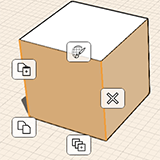
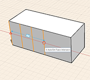

# 修正: 傾斜を適用、配列化、コピー、貼り付け

---

以前に描画した形状を変更して、より複雑な設計を作成します。

## ジオメトリを変更する

形状をスケッチするか、プリミティブを配置した後、より複雑な設計を作成するには、いくつかのコンテキスト ツールを使用してジオメトリを修正します。修正操作としては、[傾斜]、[ファセット] (Web 専用)、[コピー]、[貼り付け]、[配列]などがあります。

1. 面を傾斜させるには、対象の面を選択して右クリックし、コンテキスト メニューを表示します。 コンテキスト メニューから[傾斜]アイコンを選択します。次に、線分を描画して傾斜軸を定義します。さらに、3 番目の点をクリックして、傾斜操作を開始します。
2. 面にカーソルを合わせると点線が表示される場合は、歪んでいる面が複数の小さな面で構成されていることを意味します。 点線をモデルのエッジに変換するには、最初に面(またはオブジェクト)を選択し、右クリックしてコンテキスト メニューを表示します。コンテキスト メニューから[ファセット]アイコンを選択します。滑らかだった面にエッジが追加されます。
3. 面、エッジ、またはオブジェクトをコピーして貼り付けるには、最初にそのいずれかを選択し、コンテキスト メニューから[コピー]アイコンを選択します。 コンテキスト メニューをもう一度表示して、貼り付けます。貼り付けるときには、スナップと推定配置点のオプションが表示されます。[Ctrl]キーを長押ししてオブジェクトをドラッグし、すばやくコピーします。
4. エッジ、面、またはオブジェクト全体を配列するには、コンテキスト メニューの[配列]アイコンをクリックします。 直線配列と円形状配列の両方を作成できます。次に、[直線]または[円形状]のどちらかを選択し、その他のパラメータを指定します。移動ツールの場合と同様に、配列を開始するオブジェクトをクリックし、もう一度クリックして、配列化された要素を配置します。

