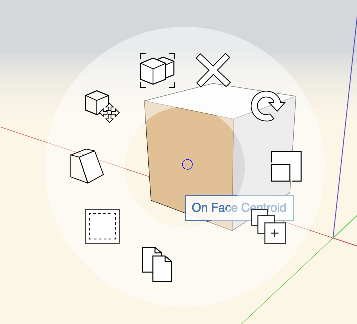
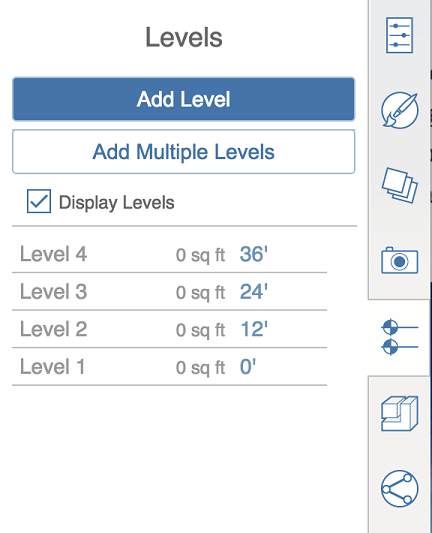
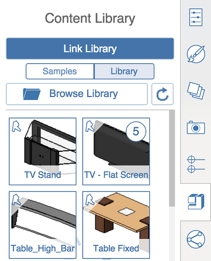
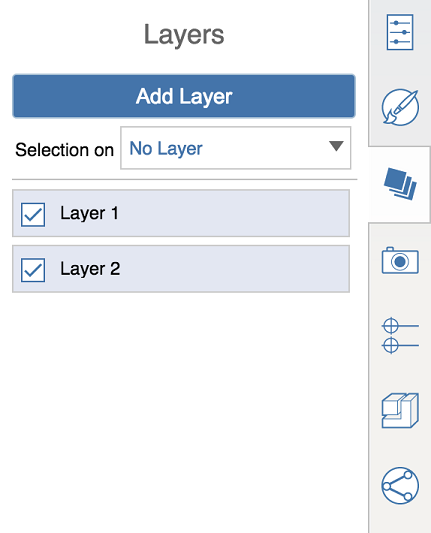

# コンテキスト メニューと右側のパレット

---

設計を作成して配置するためのツールを見つけます。

ユーザ インタフェースは、コンテキスト メニューとパレットで構成されています。

* コンテキスト メニューを表示するには、オブジェクトまたは空のスペースを右クリックします。選択内容のセットに応じて異なるツールがコンテキスト メニューに表示されます。これらのツールを使用して選択内容を編集できます。

   キャンバスのコンテキスト メニュー     ソリッドのコンテキスト メニュー     グループのコンテキスト メニュー     面のコンテキスト メニュー 

## パレット

|
|
|
| -- | -- |
|プロパティ パレットを表示または非表示にするには、パレットのハンドルをクリックします。オブジェクトの名前、レベル設定、レイヤ設定を管理し、選択したオブジェクトの面積と体積に関する情報を表示するには、[プロパティ]タブを使用します。||
|マテリアルを作成、編集し、オブジェクトに適用するには、[マテリアル]タブを使用します。||
|スケッチでレベルを作成、編集する際、要素のレベルを設定しない([プロパティ]タブで設定している)場合は、[レベル]タブを使用します。||
|ローカル コンピュータまたは A360 ドライブからライブラリをリンクするには、[コンテンツ ライブラリ]を使用します。ライブラリから FormIt 360 スケッチにコンテンツをドラッグ アンド ドロップできるようになります。||
|設計の作成中に他のユーザと同時に作業するには、[コラボレーション]を使用します。||
|レイヤを作成、修正するには、レイヤ パレットを使用します。現在選択しているオブジェクトを特定のレイヤに追加することもできます。||
|シーンを作成、修正するには、シーン パレットを使用します。現在のファイル内にあるすべてのシーンを順に切り替えるには、[シーンを再生]をクリックします。||

