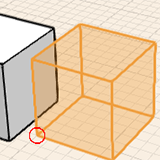
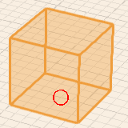

# ナビゲーション ツール

---

ツールを使用して移動し、ユーザ インタフェースを使用します。

設計領域内を移動するための主要なツールを紹介します。

### ビュー モード

| | |
| ---- | ---- |
|上部ビュー|プロジェクトを上部から表示します。このビューでは回転を実行できませんが、画面移動とズームは正常に機能します。このビューは、読み込んだスケッチや衛星画像に平面図をスケッチする場合に特に役立ちます。|
|3D ビュー|FormIt 360 はこのパース ビューで起動します。回転、画面移動、ズームを実行し、モデルを表示、編集できます。|
|フライスルー モード|地盤面からの主観視点によるパース モードです。編集ツールは無効になりますが、キーボードや[Spacebar]を使用してモデルをウォークスルーまたはフライスルーできます。[Esc]キーを使用してこのモードを終了すると 3D ビュー モードに戻りますが、視点は維持されます。|

### ビューのナビゲーション

| | | |
| ---- | ---- | ---- |
|画面移動|中マウス ボタンをクリックしてドラッグします|
|
|オービット|マウスを右クリックしてドラッグします|
|
|ズームインおよびズームアウト|マウス中央のスクロール ホイールを使用します|

### ジオメトリを作成するためのジェスチャ

| | | |
| ---- | ---- | ---- |
|オブジェクトをコピーする|オブジェクトを選択し、[Ctrl]+[C]、[Ctrl]+[V]をクリックします。||
|2D シェイプを描画する|[線分]、[円弧]、[スプライン]、[円]、または[長方形]ツールをクリックし、キャンバス内でクリックして描画します。||
|シェイプを押し出す|面をクリックして選択した後、クリックしてマウスをドラッグします。面の押し出しを終了するにはもう一度クリックします。||
|プリミティブを配置する|アクション バーでプリミティブをクリックし、キャンバス内をクリックします。||

#### フライスルー モード

* フライスルー モードを使用すると、カメラ角度の視点を選択して設計を表示できます。 また、作図領域全体を上空から自動的に表示することもできます。フライスルー モードに入るには、[ジェット パック]アイコンを使用します。

### フライスルー モードのキーボード コントロール

| | |
| ---- | ---- |
|ウォーク|[W]で前方に移動し、[S]で後方に移動し、[A]で左に移動し、[D]で右に移動します|
|クライム|[Q]で上昇し、[E]で下降します|
|ジェット パック|[Spacebar]で離昇します|
|周囲を見回す|見たい位置にマウス カーソルを合わせます|
|終了|[Esc]をクリックするとフライスルー モードが終了します|

