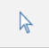
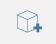
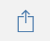

# ユーザ インタフェース ツール

---

コマンド操作ツールを紹介します。

## 情報の領域

* スケッチを保存: これをクリックすると、現在のスケッチを保存するか、新しいスケッチを開くことができます。
* 名前を設定: これをクリックすると、スケッチの名前を変更できます。
* 元に戻す/やり直し: これをクリックすると、最近の操作を元に戻すか、やり直すことができます。
* *ナビゲーション バー*

| | | | ---- | ---- | |  | *上部ビュー*: 平行投影ビューに切り替えて上部から見下ろします   *3D ビュー*: 既定の 3D パース ビューに戻ります  *ジェット パック*: 従来のゲーム コントロールを使用してウォークスルー ビューに切り替えます。 [W] - 前方、[S] - 後方、[A] - 左、[D] - 右、[Q] - 上、[F] - 下、[Spacebar] - 離昇  *選択*: 選択モードに戻ります  *オービット*  *画面移動*  *ズーム*  *ズームして全体を表示*  |

## アクション バー

* アクション バーは、画面の上部に表示されます。アクション バーのツールを使用すると、コンテンツを作成、編集、共有できます。

* ユーザ ID、ヘルプ バー 

* 選択フィルタ: これをクリックすると、特定のオブジェクト タイプをフィルタから除外するためのオプションを選択ツールから選択できます。

* 計測ツール: これをクリックすると、直線計測ツールまたは角度計測ツールを選択できます。
* スケッチ ツール: これをクリックすると、形状を描画できる作成ツールのメニューが表示されます。
* プリミティブ: これをクリックすると、シーンに配置できる基本的な 3D 形状のメニューが表示されます。
* 高度なツール: これをクリックすると、ブール演算の切り取り、結合、かぶり、スイープ、ロフトを使用できます。
* グループ: これをクリックすると、オブジェクトをグループ化するためのツールを見つけることができます。
* 太陽と影: このツールを使用すると、日時を変更してモデルの影を調査できます。 太陽と影について詳しくは、「[太陽と影の設定](../../Building Performance/Sun and Shadow Settings.md)」を参照してください。 日照解析はこのパネル内から起動してください。
* 設定: アプリケーション、スケッチ、表示スタイルを設定し、モデル診断を実行します。
* 位置を検索し、衛星画像をスケッチに読み込みます。 スケッチの位置の設定方法について詳しくは、「位置」を参照してください。
* エネルギー解析: これをクリックすると、建物のエネルギー使用を計算して算出できます。
* イメージとモデルを読み込み: このツールを使用すると、他のプログラムで作成したイメージやモデルを追加することができます。
* 作業を共有: モデルを別の形式に書き出します。
* 日照解析、エネルギー解析、コラボレーションの各機能へのアクセスを取得します。
* Autodesk 360 にログイン: 無償の Autodesk 360 クラウドにスケッチを保存し、共有することができます。
* ヘルプ: 情報ツールを使用して FormIt 360 の詳細を確認できます。

## パレット バー

パレット バーは画面の右側に表示されます。これらのアイコンのいずれかをクリックして横にパレットを開き、建物のプロパティ、マテリアル、コンテンツ ライブラリ、コラボレーション ツールを表示します。

| | |
| ---- | ---- |
||*プロパティ*: このパレットを開くと、スケッチの位置、総面積、床面積率を表示できます。*マテリアル*: このパレットを使用すると、マテリアルを作成または適用できます。*レイヤ*: レイヤを作成、管理し、選択したオブジェクトを別のレイヤに割り当てます。*シーン*: シーンを作成、管理、再生します。*レベル*: このパレットを使用すると、レベルを表示して建物オブジェクトに追加できます。*コンテンツ ライブラリ*: [コンテンツ ライブラリ]を使用すると、家具などの再利用可能なコンテンツを保存できます。*コラボレーション*(FormIt 360 Pro のみ): [コラボレーション]を使用すると、設計の作成中に他のユーザと同時に作業できます。|

