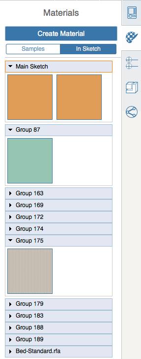

# レベルとマテリアルをグループに適用する

---

多数のオブジェクトに対して一度に適用できる方法です。

## レベルを適用する

1. グループからオブジェクトを 1 つ選択します。編集モードには切り替えないでください。
2. 右側にあるプロパティ パレットを開きます。
3. [レベル別の領域]をオンにし、[レベル]を選択して、選択したオブジェクトに適用するレベルを選択します。
## マテリアルを適用する

| | |
| ---- | ---- |
|1. グループを選択し、ダブルクリックして編集します。次に、画面の右側にあるパレットを開きます。2. [マテリアル]タブで、[サンプル]から組み込みのマテリアルを見つけて適用するか、または[新しいマテリアルを作成](../../Visualizing Your Design/Using Materials/Apply a Material.md)します。3. あるグループで作成されたマテリアルを別のグループに適用するには、マテリアル パレットで[スケッチ内]タブをクリックします。4. グループのリストを参照し、現在のグループに適用するマテリアルを見つけます。5. マテリアルにマウスを合わせてペイント ブラシのアイコンをクリックし、選択した面にマテリアルをペイントします。注: グループを編集しないで個々のグループ インスタンスにマテリアルを適用することもできます。||
| |     |

