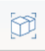
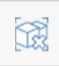

# オブジェクトをグループ化する/グループ化を解除する

---

操作を容易にするため、ジオメトリをクラスタにまとめます。

#### オブジェクトをグループ化する

1. ツール バーの[グループ]アイコン  をクリックします。
2. グループ化するオブジェクト(面またはオブジェクト)をクリックします。
#### オブジェクトのグループ化を解除する

1. 既にグループ化されているオブジェクト セットのグループ化を解除するには、[グループ化を解除]アイコン をクリックし、グループをクリックします。

