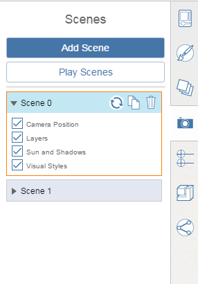

# シーン

---

シーンを使用して視点を作成、保存し、保存した視点に戻ります。

## シーンを作成、修正する

1. シーン パレットで[シーンを追加]ボタンをクリックします。現在のカメラ位置、[レイヤ](../Layers.md)状態、[太陽の位置](../../Building Performance/Sun and Shadow Settings.md)、[表示スタイル](../../Application and Sketch Settings/Sketch Settings.md)のすべてがこのシーンに保存されます。
2. シーン名を変更するには、シーン名をダブルクリックします。
3. 現在表示されている視点と設定に基づいてシーンを更新するには、[更新]ボタン  をクリックします。
4. 現在のシーンのコピーを作成するには、[複製]ボタン  をクリックします。
5. 現在のシーンを削除するには、[削除]ボタン  をクリックします。
6. カメラ位置、[レイヤ](../Layers.md)状態、[太陽の位置](../../Building Performance/Sun and Shadow Settings.md)、または[表示スタイル](../../Application and Sketch Settings/Sketch Settings.md)をシーンに適用するかどうかを指定するには、各シーンの下にあるチェック ボックスを使用します。

## シーンをナビゲートする

1. ナビゲート先のシーンをクリックします。
2. 各シーンを自動的に再生するには、[シーンを再生]をクリックします。
3. 再生を停止するには、[シーンを停止]をクリックします。

