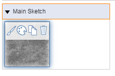

# マテリアルを適用する

---

マテリアル エディタを使用して、オブジェクトまたは選択したオブジェクト面にマテリアルを配置します。

マテリアルは面またはオブジェクト全体に適用できます。

## マテリアルを適用する

1. 画面の右側にあるタブをクリックし、マテリアル エディタのアイコンをクリックします。
2. 適用先のマテリアルにマウス ポインタを合わせます。

3. ペイントブラシのアイコンを選択します。
4. マテリアルを単一の面に適用するには、面をクリックします。マテリアルをオブジェクト全体に適用するには、ダブルクリックします。
## マテリアルをグループに適用する

スケッチでグループ化されていないオブジェクトに適用されたマテリアルは、[メイン スケッチ]という見出しの下に表示されます。マテリアルをグループ内の面またはオブジェクトに適用するオプションは 2 つあります。

1. *グループ インスタンス*: マテリアルをグループ全体に適用する際、グループの他のインスタンスには適用する必要がない場合は、上記の手順に従ってグループ インスタンスをペイントできます。
2. *グループ定義*: マテリアルをグループのすべてのインスタンスに適用する場合は、最初に[グループを編集](../../../Using Groups/Edit Group.md)した後、上記の手順に従います。 これで、グループ名が記載された見出しの下にマテリアルが表示されます。

