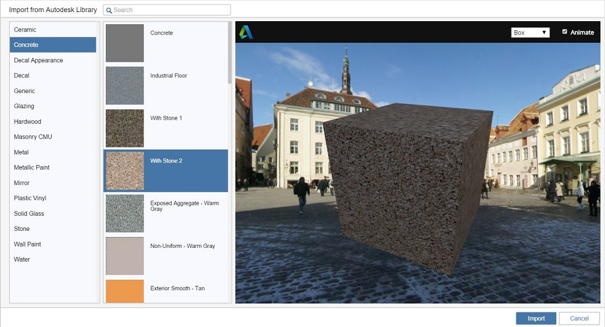

# マテリアルを作成する

---

マテリアル エディタを使用して、シーンで使用する新しいマテリアルを作成します。

カスタム ビットマップ ファイルに基づいて独自のマテリアルを作成できます。

## マテリアルを作成する

1. [マテリアルを追加]ボタンをクリックします。
2. [[マテリアルを編集]](../Edit a Material.md)ウィンドウで、マテリアル プロパティに必要な変更を加えます。
3. [OK]をクリックして、マテリアルの変更内容を保存します。
## オートデスク マテリアルを読み込む 

オプションの [FormIt 360 Pro Subscription](http://www.autodesk.com/products/formit-360/try-buy) を購入している場合、Autodesk Materials Library からマテリアルを読み込むことができます。

1. マテリアル パレットで、[マテリアルを読み込む]をクリックします。
2. [マテリアルを読み込む]で、シーンに読み込むマテリアルを参照するか名前で検索して選択し、[OK]をクリックします。
3. マテリアルが、他のマテリアルと同様に[適用](../Apply a Material.md)または[編集](../Edit a Material.md)できるようになります。

