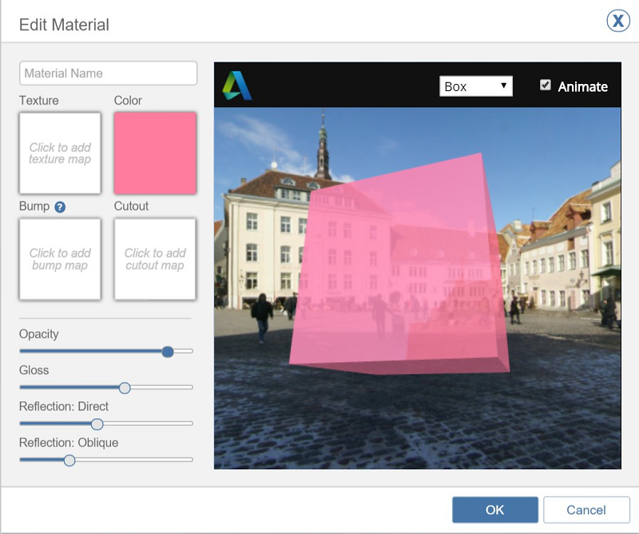
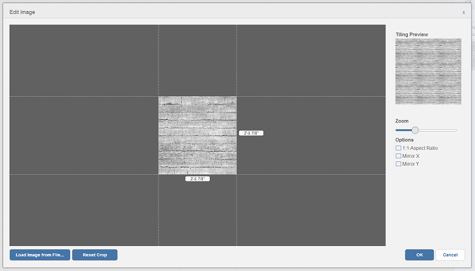

# マテリアルを編集する

---

マテリアル エディタを使用して、マテリアルを希望どおりに正確に表示します。

テクスチャ、カラーなど、マテリアルのプロパティはマテリアル エディタで修正できます。

## マテリアルを編集する

1. マテリアルを選択します。
2. [編集]アイコンを選択します。

3. 

4. [マテリアルを編集]ウィンドウでは、次のプロパティを変更できます。変更すると、右側にあるプレビュー イメージが更新されます。

* *名前*: マテリアルを識別できるようにします。
* *テクスチャ*: テクスチャはローカル ドライブからロードされるイメージです。 読み込まれると、テクスチャの水平スケールと垂直スケールをトリミング、編集できます。

* *カラー*: マテリアルにテクスチャとカラーの両方を設定すると、それらが掛け合わせられます。
* *バンプ*: テクスチャをロードし、イメージに基づいて凹凸を適用します。
* *カットアウト*: 白黒のビットマップをロードします。 白色領域はソリッドととして表示され、黒色領域は透明になります。
* *透過性*: 値が大きくなるほどマテリアルは透明になります。
* *光沢*: 値が大きくなるほどマテリアルの光沢が増します。
* *反射: 正面*: 値が大きくなるほど面を正面から見た場合の可視反射量が大きくなります。
* *反射: 斜め*: 値が大きくなるほど面を斜めから見た場合の可視反射量が大きくなります。

5. [OK]をクリックして、マテリアルの変更内容を保存します。

