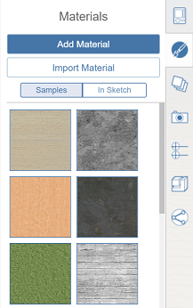

# マテリアルを使用する

---

マテリアルを使用して詳細を追加することにより、内容が充実した高度な設計を作成できます。

マテリアル エディタは右側のパレットにあります。エディタで新しいマテリアルを作成し、[マテリアル ライブラリ]に追加できます。マテリアルにカラーを追加するには、カラー ピッカーを使用してマテリアルの着色を正確に設定するか、設定済みの色見本を選択します。

* 組み込みのライブラリからいずれかのサンプル マテリアルを使用することも、独自のマテリアルを作成することも、Autodesk Material Library ([FormIt 360 Pro Subscription](http://www.autodesk.com/products/formit-360/try-buy) を購入している場合にのみ使用可能)からマテリアルを読み込むこともできます。 マテリアルを使用すると、スケッチ内のジオメトリに詳細を追加できます。

#### このセクションの内容

* [マテリアルを作成する](../Create a Material.md)

マテリアル エディタを使用して、シーンで使用する新しいマテリアルを作成します。

* [マテリアルを編集する](../Edit a Material.md)

マテリアル エディタを使用して、マテリアルを希望どおりに正確に表示します。

* [マテリアルを適用する](../Apply a Material.md)

マテリアル エディタを使用して、オブジェクトまたは選択したオブジェクト面にマテリアルを配置します。

